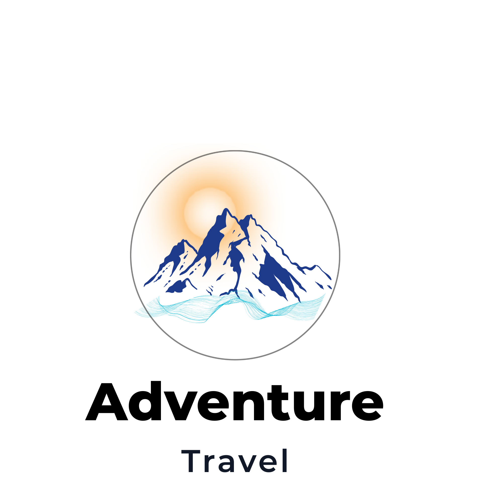

# CodeAlpha Logo Redesign

## Overview

This project was created as part of the **CodeAlpha Graphic Designing Internship**.

The objective was to redesign a logo with a clean, modern, and memorable visual identity while maintaining simplicity and versatility.

---

## Design Concept

- 🏔️ Mountains represent adventure, exploration, and strength.
- ☀️ The rising sun symbolizes hope and new beginnings.
- 🌊 The wave represents travel, movement, and freedom.
- 🔤 Bold typography creates a modern and memorable brand identity.

---

## Tools Used

- Canva

---

## Project Deliverables

- Logo Redesign
- Color Palette
- Typography Selection
- Logo Variations
- Business Card Mockup
- T-shirt Mockup
- Presentation Board

---

## Preview

---

**Designed by Anum Rafaqat**
